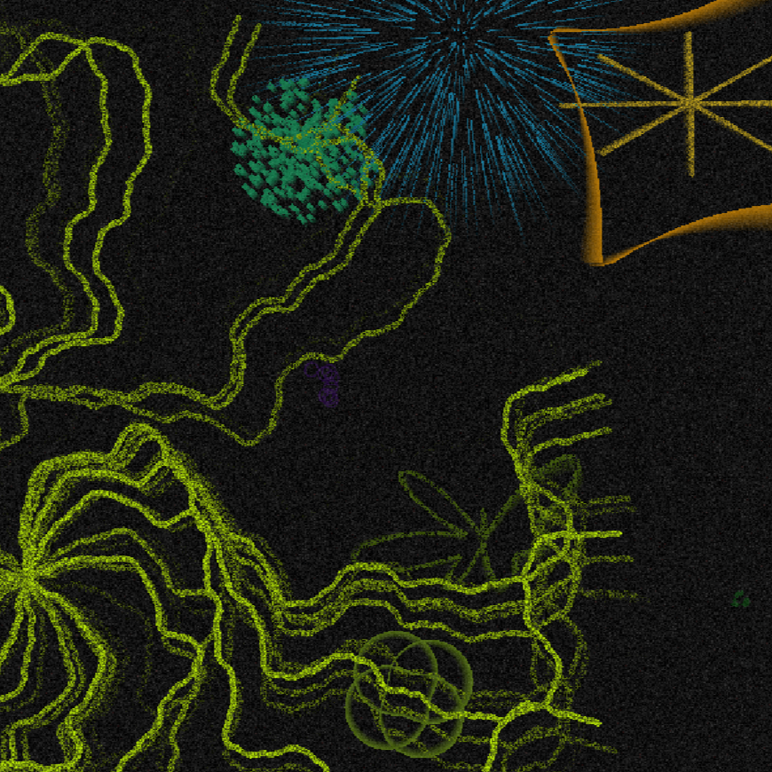

---
> Copyright © 2026 TrafkHop Entertainment™
> All rights reserved.
---
>This Project is Source Available, NOT Open Source!
---
>This Project was coded by AI with strict human vision controls!
---

A little C Program, that randomly generates forms that also make music. Not actually a screensaver, but sure does look like one!!

## How to use the program
Download the Install.sh from latest Release of (even better) from the source code!
Run the **Install.sh** file.
Start the program from your Launcher or from the program filepath provided by the installer.

## Ranking
After all 4 AIs have "finished":
1. DeepSeek (1.10.26 free flash model with internet and deepthink)
   The First Version already was "the best" of all of the first versions and after 9 its pretty much perfect.
2. Claude (Sonnet 5.5 Low)
   Came close enough to my prompt, it has some nice figures but thats it. there are random colour points in the noise that do not make any sound, its not that nice, its fine but not exactly what i wanted.
3. ChatGPT (Free Tier)
   The Particle animations are nice?! But it just did not follow the prompt.
4. Gemini (3.1 Pro & 3.6 Flash, both Erweitert)
   There is not even any noise AFTER 4 VERSIONS.
   No noise, loud sounds, basic shapes, big shapes, not good, its just not good.

## How it was created
HoppiTex was watching a YT video of https://www.youtube.com/@TheMorpheusTutorials where he said something about randomness (edit: MorphDemo was the video, the first where he did the test with MorphDemo).
Then he (HoppiTex) thought of the phenominon where when you close your eyes, noise build up and it creates forms that float around.

To he wrote a Prompt and gave it to gemini, deepseek and claude.
Gemini sucked ass, claude did not have enough tokens and deepseek cleared the task with ease. And after 8 Versions and a 9. tweak by Hopx himself it was done.